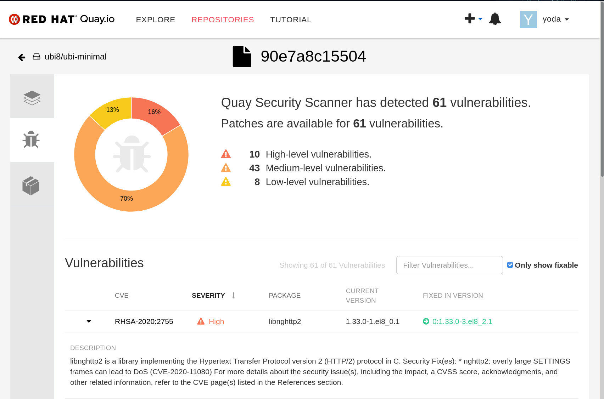
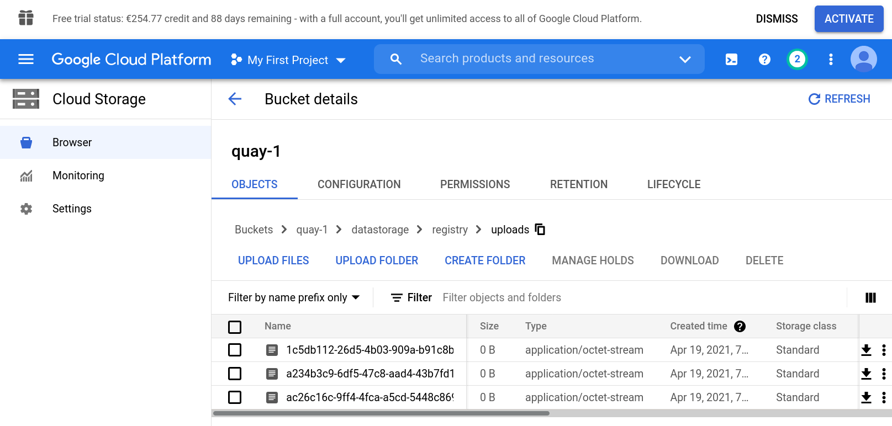

# Quay HA Ansible Playbooks

These playbooks can be used to setup Quay 3.3.4 and Clair 3.3.4 in an HA configuration following the docs [here](https://access.redhat.com/documentation/en-us/red_hat_quay/3/html/manage_red_hat_quay/index).

## Prerequisites

* RHEL 8.x VMs with podman installed.
* DNS records or Load-Balancer Setup for multiple Quay instances, multiple Clair instances, Redis and Postgres
* Certificates and Private Keys for Quay and Clair and CA certificates. These are provided pre-signed for a local *.dev* domain in the inventory.
* Expects *firewalld* and *SeLinux* to be enabled and firewall opened for ports 8443 for config_mode, 443 for quay, 5432 for Postgres, 6379 for Redis, 6060 and 6061 for Clair. 6062 and 6063 are used internally by Clair.
* S3 storage

### Notes

* Tested on RHEL 8.2 with Ansible 2.9.16
* Will install Quay, Clair, Redis and Postgresql DB for Quay, Clair and Redis

## Quickstart

* Consult the [Quay Enterprise 3.x Tested Integrations](https://access.redhat.com/articles/4067991) KB Article.
* Create 4 or more VMs. 4 would run the cluster minimum (unsupported). 6 or more would an ideal setup for start with HA (supported).
* Adapt the inventory or adapt `ansible.cfg` to your inventory
* Replace all certs or use given ones if you have the same domain
* Run `ansible-playbook p_setup-all.yml`
* Consider running the included Smoke Test Suite

## Path to Quay 3.5.x

* Version increments are n-1. This means subsequent updates have to be done in order to get to the latest version.
* For this you can either alter these playbook's config mode part or do a container-by-container update strategy as described [here](https://access.redhat.com/documentation/en-us/red_hat_quay/3.5/html/upgrade_red_hat_quay/standalone_upgrade#upgrade_to_v3_5_0_from_v3_4).

## Screenshots 

### *Clair High Availability Mode*


### *GCE S3 Storage for Image Data*


# Usage of Playbooks

* Make modifications for your environment in the inventory files. This inventory files try to serve as single source of truth, in order to maximize compatibility of these playbooks with Ansible Tower.
* Most Quay options start with `clair_` or `quay_`.
* Secrets and certs are stored in group_vars/all.yml and are encrypted.
* Mark individual hosts with _is_quay=true_ and _is_clair=true_ to run those components on the respective hosts.
* Review `roles/quay/defaults/main.yml` for default variable values and options and feel free to move more parameters to the inventory
* The pre-provided Certificates are non-SAN, self-signed and valid for local .dev domain. The Vault PW is in the inventory.

## Quay Config

Quay Config is split into 

### Role-based 

`config.yaml` 

```bash
roles/quay/files
├── quay
│   └── config.yaml
```

### Inventory-based

`quay.yml`

```bash
inventories/dev/
├── group_vars
│   └── quay.yml
```

### Layering of Quay Config in Playbooks

This are two important files, which you most certainly want to change. This file is built in layers by the Playbooks.

1. Config object response from quay config mode API
2. Reuse of *DATABASE_SECRET_KEY* from first found existing config.yaml on re-run
3. Some sane defaults from `roles/quay/files/quay/config.yaml`
4. Values from 'quay_config' variable defined in inventory.

Quay's resulting `config.yaml` file is where everything gets merged into and validated in config mode of the playbooks.

### Storage

```yaml
...
FEATURE_STORAGE_REPLICATION: true
DISTRIBUTED_STORAGE_CONFIG:
  default:
  - RHOCSStorage
  - access_key: "{{ secrets.access_key }}"
    secret_key: "{{ secrets.secret_key }}"
    bucket_name: quay-datastore-9b2108a3-29f5-43f2-a9d5-2872174f9a56
    hostname: s3.openshift-storage.svc.cluster.local
    storage_path: /datastorage/registry
    is_secure: true
    port: 443
...
```

### LDAP
If LDAP is used, AUTHENTICATION_TYPE must be set to `LDAP` and SUPER_USERS variable must contain the list of LDAP users which will have admin permissions.

```yaml
SUPER_USERS: [user1, user2, user3]
...
AUTHENTICATION_TYPE: LDAP
LDAP_ADMIN_DN: uid=admin,cn=users,cn=accounts,dc=shared,dc=example,dc=opentlc,dc=com 
LDAP_ADMIN_PASSWD: "{{ secrets.ldap_password }}"
LDAP_BASE_DN:
- cn=accounts
- dc=shared
- dc=example
- dc=opentlc
- dc=com
LDAP_EMAIL_ATTR: mail
LDAP_UID_ATTR: uid
LDAP_URI: ldap://ipa.shared.example.opentlc.com
LDAP_USER_RDN:
- cn=users
LDAP_SECONDARY_USER_RDNS:
- cn=users2
FEATURE_TEAM_SYNCING: true
TEAM_RESYNC_STALE_TIME: 1m
...
```

## Clair Config

```bash
roles/quay/files
├── clair
│   └── config.yaml
```

This is an important file in addition to the inventory.
Security Scanner options are gathered either by

   * Re-use of `security_scanner.pem` file and ID if already present on all clair hosts and known by the Quay config API responses
   * New Key by Quay Config API generating a key


In the Clair `config.yaml` file you can change default ports or certificate and SSL options.

```yaml
  verifier_proxies:
    - enabled: true
      # The port at which Clair will listen.
      listen_addr: :6060

      # If Clair is to be served via TLS, uncomment these lines. See the "Running Clair under TLS"
      # section below for more information.
      key_file: /clair/config/ssl.key
      crt_file: /clair/config/ssl.crt
      ..
```


## Inventory

The Inventory contains a `hosts` file and `group_vars` directory with quay, redis, postgres files for the according host groups. All certificates and private keys are stored in the inventory.

```bash
inventories/
└── your.domainname
    ├── group_vars
    │   ├── all.yml
    │   ├── local.yml
    │   ├── postgres.yml
    │   ├── quay.yml
    │   └── redis.yml
    └── hosts
```


### all.yml

```yml
drop_quay_db: true
delete_old_quay_config: true
remove_all_folders: true
remove_redis_container: true
remove_quay_container: true
...
quay_db_admin_username: postgres
quay_redis_port: 6379
quay_db_password: "{{ secrets.quay_db_password }}"
postgres_ssl_crt: "{{ certs.postgres_ssl_crt }}"

secrets:
  quay_db_password: !vault |
  ...
  
certs:
  postgres_ssl_crt: !vault |
  ...
```
_The all.yml file is where all the secrets and certificates and most of the variables are defined._

### quay.yml

```yml
quay_config:
  # Merged on top of default API config + Role config file
  # See: # https://access.redhat.com/documentation/en-us/red_hat_quay/3/html/manage_red_hat_quay/quay-schema
  SUPER_USERS: [ yoda ]
  DB_URI: "postgresql://{{ quay_db_username | urlencode }}:{{ quay_db_password | urlencode }}@{{ quay_db_hostname }}:{{ quay_db_port }}/{{ quay_db_dbname }}"

  # GCE
  #
  DISTRIBUTED_STORAGE_CONFIG:
    default:
      - GoogleCloudStorage
      - {
          storage_path: /datastorage/registry,
          access_key: accesskey,
          secret_key: "supersecretkey",
          bucket_name: quay-1
        }
  DISTRIBUTED_STORAGE_DEFAULT_LOCATIONS: [europe-west6]
  DISTRIBUTED_STORAGE_PREFERENCE: [default]
  DEFAULT_TAG_EXPIRATION: 4w
  ...
```

### hosts

```ini
[postgres]
postgres.dev

[postgres:vars]
postgres_runtime_user=postgres

[redis]
redis.dev

[redis:vars]
redis_runtime_user=redis

[quayconfig]
quay.dev is_quay=true

[quay]
quay.dev is_quay=true 
quay-ha.dev is_quay=true 
clair.dev is_clair=true

[all:vars]
redis_vm_user=user
postgres_vm_user=user
quay_vm_user=user
...
```


### Defaults

```bash
roles/quay/
├── defaults
│   └── main.yml
```

The `quay` role also contain _defaults_ where variables such as setup client can be changed, e.g.:

```yaml
...
quay_setup_client: "{{ groups['quayconfig'][0] }}"
...
```

# Program Flow

It is helpful to visualise the flow of the playbooks, e.g. the `p_setup-all.yml` playbook:

```bash
p_setup-quay-ha.yml
 Setup Quay runtime user
 Setup Clair runtime user

 r_role/main.yml
   r_role/database.yml 
     Setup postgres
     Quay db
     Quay user
     Clair db
     Clair db user
     Extensions
  
  Quay DB SSL Mode
  Clair DB SSL Mode
  Quay Directories
  Repomirror Directories
  Clair Directories
  SeLinux
  Copy Certs
  Unit Tests

r_role/setup.yml
  r_role/Container-quayconfig.yml
    Run Container 
    Copy DB CA File
    Quay Config
    Config Validate
    Remove Config Container

  Copy Quay Config
  Repomirror Config
  Copy Quay Certificates
  Clair Copy
  Clair Key File

  r_role/unit-test-clair.yml
  r_role/container-quay.yml
    Remove Old Container
    Run Quay
    Daemonize Quay
    Unit Test Service
    Run Repomirror
    Run Container Quayconfig
    Daemonize Quay Repomirror
    Unit Test Service Repomirror

  r_role/container-clair.yml
    Remove old container
    Run clair
    Daemonize clair
    Unit test service
```

Then next, you could run `p_smoke_test.yml` playbook to verify the success of your installation.

# Testing

1. **Create Organisation**, e.g. `ubi8` in your deployed Quay User Interface


2. **Create a private Repository**, e.g. `ubi-minimal`


3. **Create the Robot "test_robot"** in the Quay UI by clicking on the hog wheel icon on the left hand side and then the drop down arrow and after creation make sure full robot+name is linked with full admin permissions to the repository you just created


4. **Get the Robot Token** by clicking on the name of your test robot which is underlined. Again, link the robot token to the playbook's all.yml group file of your inventory, var name is `quay_test_robot_password`.


5. **Create Oauth Application** and Token in quay's angular ui. For that you click on Organisational View and then the Applications Icon on the left hand side. You can name the app anything you prefer, e.g. `test_app`.


6. **Click on the Underlined App Name**, then on Generate Token icon, which looks like a little cinema ticket.
    There you give the following minimal right: Create Repo, View Repo, R/W Repo, Read User. Click authorize green button. Copy the token.


7. **Provide the Token** in Playbooks `all.yml`. The variable name is: `quay_system_test_bearer`


8. **Provide the test_image** in your root-registry or locally. If locally, set host variable `test_skip_login_pull=true`.
   *Link it* from `group_vars/all.yml`, e.g. `quay.dev/org/ubi-minimal:8.0`


9. **Run `p_smoke_test`** Playbook, this will trigger all Integration and all Systems Tests towards your new Quay.


10. **System Tests are predestined to fail in the first run**, this is to be expected. It won't find the Image ID. After successful failure of the test,
   you'll need get the *Manifest ID* from the test-automation pushed Image. Quay Ui Hint: Click on your Test-Repo, then on tags, then click on SHA256 in Manifest Column to get the content addressable SHA from the PopUp. Then reference it in `group_vars/all.yml` in the `quay_system_test_manifest` variable.


11. **Run `p_smoke_test`** Playbook again, it should test all System Tests and should test your whole Quay Cluster.


# License

Quay Ansible Playbooks are under the  GPLv3 License. See the LICENSE file for details.

Implemented by [Stephan Kristyn](https://github.com/stevek-pro) and [James Cole](https://github.com/jamcole).  These Playbooks are not supported by Red Hat.

